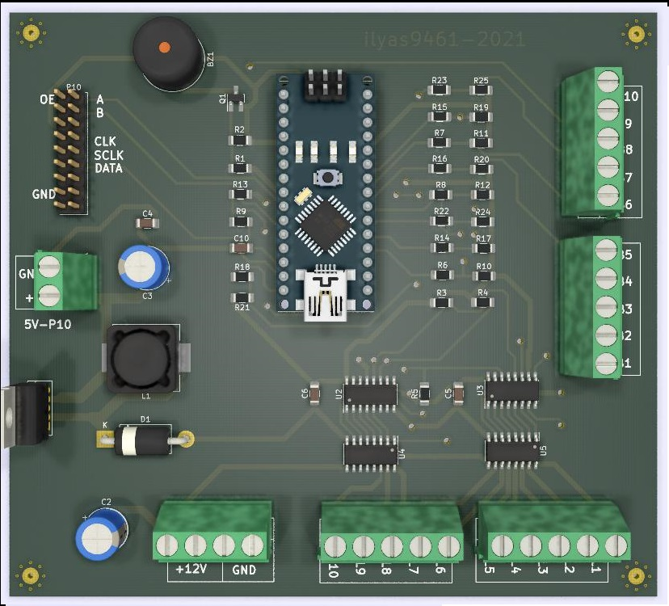
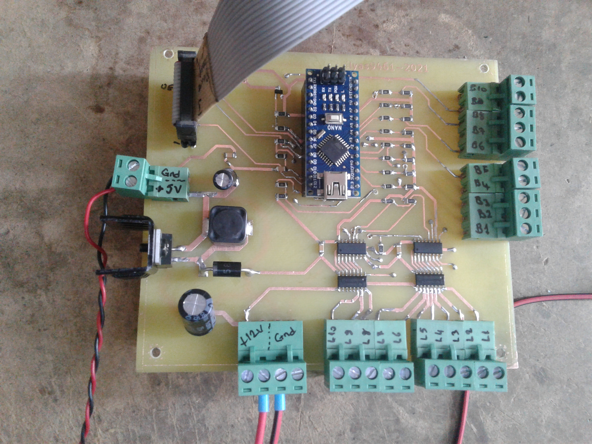

<h1 align="center">Hop Jump Ball Game (Button Count) (Hopla Zıpla Topla Oyunu)</h1>

## Contents

- [Introduction](#Introduction)
- [How is it working?](#How-is-it-working)
- [Used Technologies](#Used-Technologies)

## Introduction

It is a game designed for playgrounds called Soft Play. It is played by two people. The game features ten LED animated buttons and a P10 control panel.

The game starts when any button is pressed while in waiting mode. Randomly, the LEDs of the buttons light up in a different order for each player. The player who presses the lit button gets points. The one who collects the most points wins. The game ends when the timer expires or if no button is pressed for 20 seconds. The highest score is kept as the game record.

## How is it working?

<p  align="center">
     
</p>

Arduino nano board was used as the control element on the main board. THE P10 LED module is for displaying player scores and game animations. Nano can drive P10 modules with the library used on its own.

<p  align="center">
     
</p>


## Used Technologies

```bash
- Arduino Nano.
- Arduino programming with c++.
- P10 led modules.
- KiCad and PCB design


```

## Sample working video :

<a href="https://youtu.be/Q9nUwOI7k6M" target="_blank">
     
</a>


- GitHub [@your-ilyas9461](https://github.com/ilyas9461)
- Linkedin [@your-linkedin](https://www.linkedin.com/in/ilyas-yağcioğlu-6a6b17217)
